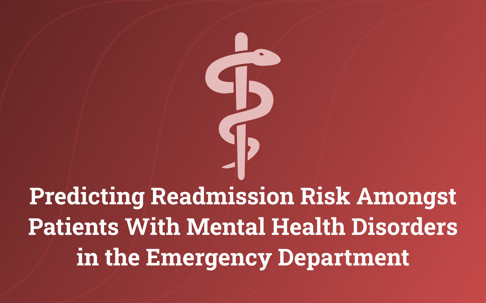
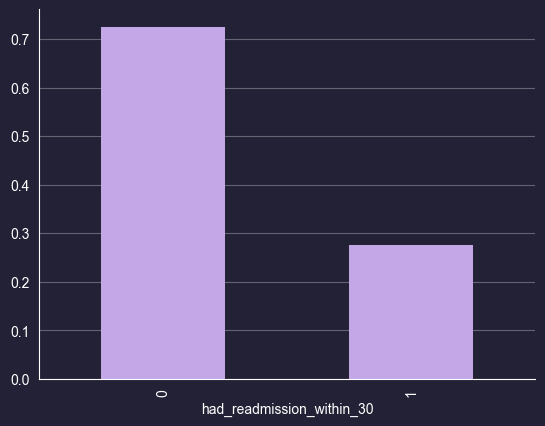
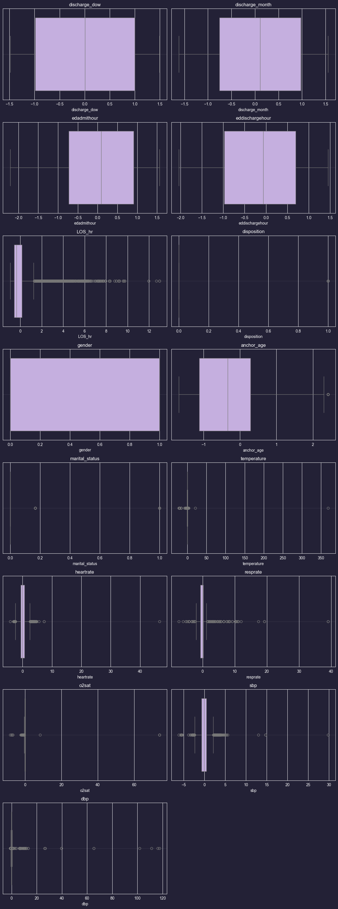
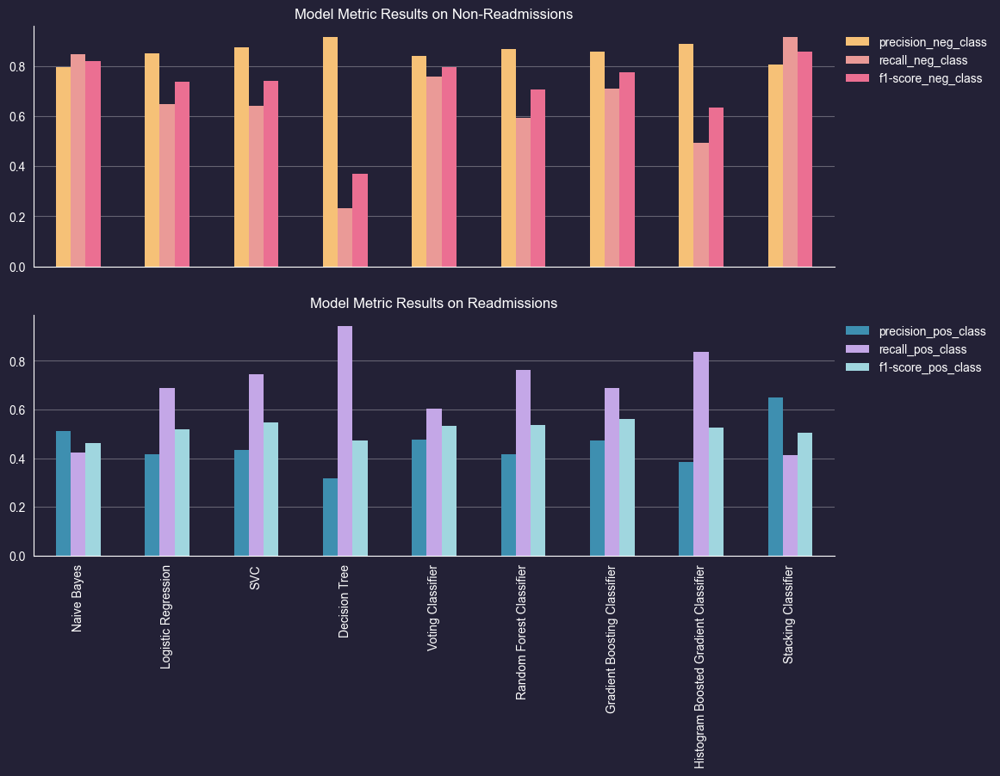
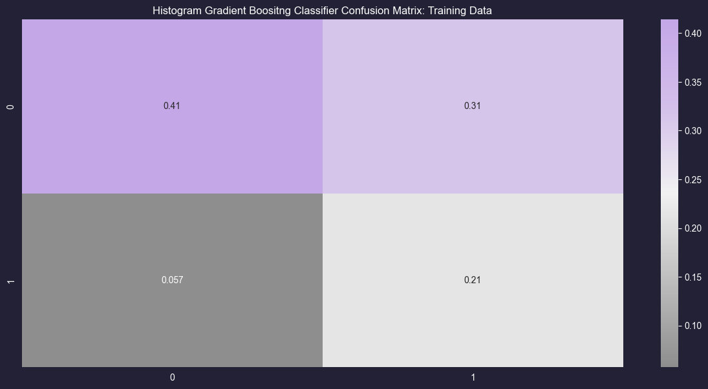

# Readmission-Risk-Prediction
 
 
## 📚 Table of Contents

1. File Sources
2. Project Introduction
3. Objectives
4. Tools
5. Data Description
6. Key Findings
7. Exploratory Data Analysis
8. Results
9. Conclusions
10. Next Steps

---

## File Sources
[Model Development](Model_Development.ipynb)

## **Project Introduction**

**Why it matters:**

- Thirty-day emergency-department readmissions cost U.S. hospitals an average **$5000** each and disproportionately affect patients with mental-health conditions.

**What I Built:**

-A Histogram-based Gradient Boosting model trained on 55,000 Emergency Department visits from the MIMIC-IV dataset to predict 30-day readmissions. The model identified 74% of readmission cases (recall = 0.74) with a precision of 0.41 and a macro-F1 score of 0.61.

**Impact:**

- Although the model is not highly precise, it effectively captures most patients at risk of readmission. This trade-off makes it a valuable screening tool to help clinicians prioritize follow-up care and intervene early—potentially improving outcomes for high-risk patients and reducing costly ED returns

---

## **Objectives**

- Build a model that predicts 30-day ED readmission risk for mental-health patients.
    
    

---

## Tools

- **Python & scikit-learn** – data processing, modeling, hyper-parameter tuning (RandomizedSearchCV)
- **Jupyter Notebooks**: Prototyping and EDA
- **Matplotlib / Seaborn**: Data visualization

---

## Data Description

- **Sources**: MIMIC-IV Emergency Department
- Variables include:
    - age
    - gender
    - insurance type
    - mental health diagnosis
    - arrival mode
    - disposition
    - binary readmission status
    - arrival date
    - discharge date
    - race

### Data Cleaning & Preprocessing

To prepare the data for analysis and modeling, I engineered a comprehensive **data cleaning pipeline** using custom transformers, which:

- Converted and standardized demographic and clinical values (e.g., gender, marital status, temperature from Celsius to Fahrenheit); U.S. hospitals actually record °F.
- Imputed missing numeric values and scaled continuous features for modeling.
- Encoded categorical features (e.g., language, diagnoses, medications, insurance type) using frequency mappings and one-hot encoding.
- Created new features such as:
    - Binary indicators for patient disposition and insurance type,
    - Aggregated counts of diagnoses, admissions, discharges, and medication frequencies.

---

## Key Findings

- The **Histogram-based Gradient Boosting (HGB) classifier** outperformed other models by achieving:
    - **74%** recall for readmitted cases—critical for minimizing missed high-risk patients. However, **~41%** precision for readmissions—leading to many false positives.
    - A more **balanced F1 score** than baseline models, making it practical for clinical use.
- The **stacking ensemble model** achieved the highest precision but had lower recall, missing more true readmissions.
- **Adjusting the classification threshold** demonstrated the trade-off between recall and precision, enabling model tuning based on clinical priorities.
- **False negatives were reduced to ~5%**, ensuring most at-risk patients were identified, though with a trade-off of a ~31% false positive rate.
- Limitations include:
    - **Class imbalance**, which made precision more difficult to optimize.
    - **Feature limitations**—missing social or behavioral health indicators that could improve prediction.

---

## Exploratory Data Analysis (EDA)

- Below I explore the data to determine the class distributions and outliers.

### Class Imbalance

- Analysis revealed ~30 % of encounters resulted in a 30-day readmission.
- Exploratory Data Analysis revealed a significant imbalance between patients who were readmitted within 30 days and those who were not. This skew can mislead traditional metrics like accuracy, which may appear high simply by favoring the majority class.
- To ensure a more reliable evaluation of model performance, I prioritized metrics beyond simple accuracy—such as precision, recall, F1-score, and the confusion matrix. These metrics provide a deeper understanding of the model’s effectiveness in identifying high-risk patients, making the analysis more robust and clinically relevant.

### Outliers

- Several columns contained outliers, which I identified using the Interquartile Range (IQR) method based on the 1st and 3rd quartiles. To handle these outliers, I imputed their values with the median, as it is more robust to skewed data. Although I planned to eventually use tree-based models—which are less sensitive to outliers—I began with simpler, more interpretable models like logistic regression and support vector machines that require scaled data free of outliers for optimal performance.
    
    

---

## Results

### Modeling

Multiple machine learning models and ensemble techniques were developed and evaluated to predict 30-day readmission risk:

- **Baseline Models:** Logistic Regression, Support Vector Classifier (SVC), Naive Bayes, and Decision Tree classifiers were trained individually to establish performance benchmarks.
- **Voting Ensemble:** A Voting Classifier ensemble combined Naive Bayes, Logistic Regression, Decision Tree, and SVC as base learners. This ensemble aggregates the predictions of each model using a simple majority (hard voting) or average of predicted probabilities (soft voting), leveraging diverse model strengths to improve overall robustness.
- **Stacking Ensemble:** To further enhance predictive accuracy, a stacking classifier was implemented. This meta-model combined SVC and Random Forest classifiers as base learners, with Logistic Regression as the meta-learner. Unlike voting, the stacking approach trains the meta-learner to optimally integrate the base learners’ predictions, learning how to weight each model's outputs to improve final prediction quality.
- **Tree-Based Models:** Random Forest, Gradient Boosting Classifier, Histogram-based Gradient Boosting (HGB) classifier was also trained. They are especially useful for non-linear data.
- **Hyperparameter Optimization:** RandomizedSearchCV with cross-validation was used to tune parameters for all models, targeting balanced performance with the macro F1 score and Recall.

This allowed me to compare ensemble strategies and pick the most reliable approach.

### Model Performance

- The stacking ensemble achieved the highest overall precision but missed more true readmissions (lower recall).
- Tree-based models such as Histogram Gradient Boosting demonstrated superior recall for the positive class (readmissions), achieving approximately 84% recall, though with low precision (~38%), indicating a tendency to over-predict positives.
- Adjusting the classification threshold from 0.43 to 0.53 revealed that increasing the threshold makes the model more conservative in predicting readmissions, slightly improving precision but reducing recall.
- Overall, no model achieved an F1 score above 70% for predicting readmissions, highlighting the challenge of this task.

### Interpretation of Findings

- The models effectively identify patients unlikely to be readmitted but struggle to consistently flag all high-risk patients without overpredicting.
- High recall in some models is valuable in a clinical setting to avoid missing patients who might deteriorate, despite the cost of some false alarms.
- The stacking ensemble, by integrating diverse models, offers a balanced approach, though precision-recall trade-offs remain.

### Model Selection

While the stacking classifier demonstrated strong precision, it achieved this at the expense of recall, resulting in fewer positive cases being detected. The Decision Tree model had the highest recall but suffered from low precision and F1 score, indicating many false positives.

The Histogram-based Gradient Boosting (HGB) classifier was selected as the final model because it struck a better balance: it had the second-highest recall (important for identifying most patients at risk) and superior F1 score compared to the Decision Tree, indicating a more reliable overall prediction performance.

### Final Model Evaluation

-Adjusting the classification threshold from 0.43 to 0.53 revealed that increasing the threshold makes the model more conservative in predicting readmissions, slightly improving precision but reducing recall. So, I opted for a  lower probability threshold to improve recall. 

This confusion matrix highlights the model’s cautious strategy: 

- True Negatives (~41%)
- True Positives (~21%)
- False Positives (~31%)
- False Negatives (~5%)

It favors **high recall** by minimizing false negatives (only ~5%), ensuring most true readmissions are captured. However, this comes at the cost of a relatively high false positive rate (~31%), meaning some patients are over-flagged for readmission risk.

In a healthcare setting, this trade-off can be acceptable because the cost of missing a high-risk patient (leading to potentially preventable readmission and worse outcomes) often outweighs the cost of additional monitoring or intervention for some low-risk patients. Thus, the HGB model supports proactive care by prioritizing patient safety and hospital resource optimization.

---

## Conclusion

- Developed predictive models to identify patients with mental health disorders at risk of 30-day readmission after discharge from the emergency department (ED).
- Among all models tested, the **Histogram-based Gradient Boosting (HGB) classifier** showed the strongest performance:
    - Achieved **high recall**, minimizing missed readmissions.
    - Maintained a more balanced **F1 score** compared to other models.
    - Well-suited for clinical settings where identifying high-risk patients is critical.
- **Challenges remain** due to:
    - **Class imbalance**, which limits model precision.
    - The **complex and multifactorial nature** of readmission risk.
    - **Incomplete or limited feature sets** in the current dataset.
- Future improvements depend on access to **higher-quality data** and inclusion of **richer predictive variables**.

---

## Future Directions

To enhance the model's effectiveness and real-world impact, future work could explore:

- **Incorporating Social Determinants of Health**: Adding variables such as housing status, employment, and support networks may improve model accuracy.
- **Refining Precision–Recall Trade-offs**: Collaborating with clinical staff to determine acceptable precision-recall thresholds for different care settings.
- **Leveraging Free-Text Clinical Notes**: Applying natural language processing (NLP) to incorporate insights from unstructured notes.
- **Exploring Deep Learning Architectures**: Neural networks may uncover more complex patterns and interactions within the data.

By advancing predictive modeling for ED readmissions, especially in the context of mental health, healthcare providers can more effectively allocate resources, intervene earlier, and reduce the financial and emotional burden of preventable readmissions—for both patients and hospitals.
